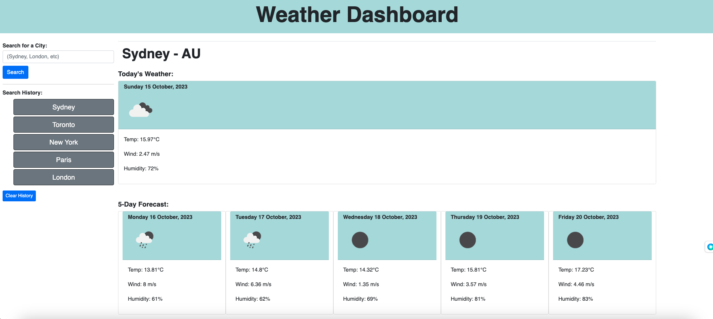

# Weather Dashboard App ☀️

## Description
The purpose of this project is to create a weather dashboard application that enables users to see both current weather of a region as well as the forecasted weather for the next 5 days.
Tools used are HTML, CSS, JavaScript, [Bootstrap CSS](https://getbootstrap.com/docs/5.0/getting-started/introduction/) and [OpenWeather Server-side API](https://openweathermap.org/forecast5#geocoding)

## Requirements
- Ensure input city is added to search history
- Ensure current and future conditions are presented for input city
- Ensure city name, date, weather icon, temperature, humidity and wind speed are presented for current weather conditions
- Ensure city name, date, weather icon, temperature, humidity and wind speed are presented for future 5-day weather conditions
- Ensure clicking on city in search history presents current and future weather conditions

## Webpage Preview

## Link to Deployed Application
[Deployed Webpage](https://ajayshans.github.io/weather-dashboard-app/)